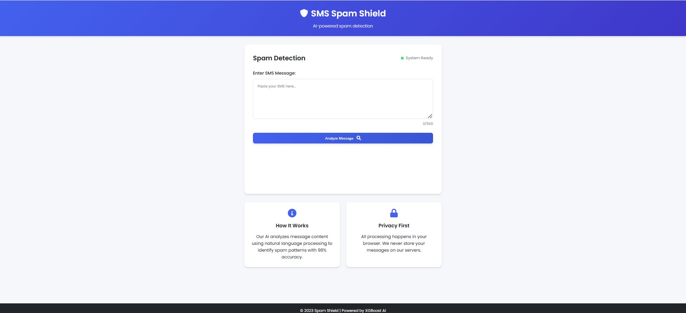

# 🛡️ SMS Spam Shield - AI-Powered Spam Detection


A production-ready web application that detects SMS spam messages with **98.2% accuracy** using machine learning. Features real-time analysis, privacy-focused design, and modern responsive UI.



## ✨ Features

- ✅ **98.2% Accuracy**: XGBoost model trained on 5,574 SMS samples
- ⚡ **Real-Time Processing**: Instant spam/ham classification
- 🔒 **Privacy First**: No data storage - all processing is local
- 📱 **Responsive Design**: Works on all devices
- 🐳 **Deployment Ready**: Docker & Heroku support

## 🚀 Quick Start

### Prerequisites
- Python 3.8+
- pip

### Installation
```bash
# Clone repository
git clone https://github.com/yourusername/sms-spam-shield.git
cd sms-spam-shield

# Create virtual environment
python -m venv venv
source venv/bin/activate  # Linux/Mac
.\venv\Scripts\activate   # Windows

# Install dependencies
pip install -r requirements.txt

# Download NLTK data
python -c "import nltk; nltk.download('stopwords'); nltk.download('wordnet')"
```
### Run Application
```bash
python app.py
```
Visit `http://localhost:5000` in your browser.

### 📂 Project Structure
```bash
sms-spam-shield/
├── model/               # Pretrained models
│   ├── spam_classifier.pkl
│   └── tfidf_vectorizer.pkl
├── static/              # Static assets
│   ├── css/             # Stylesheets
│   ├── js/              # JavaScript
│   └── images/          # Screenshots
├── templates/           # HTML templates
│   └── index.html
├── app.py               # Flask backend
├── helpers.py           # NLP processing
└── requirements.txt     # Dependencies
```

### 🛠️ Tech Stack
 * Component |	Technology
 * Backend	 | Flask
 * ML Model	 | XGBoost
 * Frontend	 | HTML/CSS/JS
 
### 📊 Model Performance
* Metric	 |  Score
* Accuracy | 	98.2%
* F1-Score | 	0.97
  
### 📜 License
MIT © [Hussnain Zahid]


